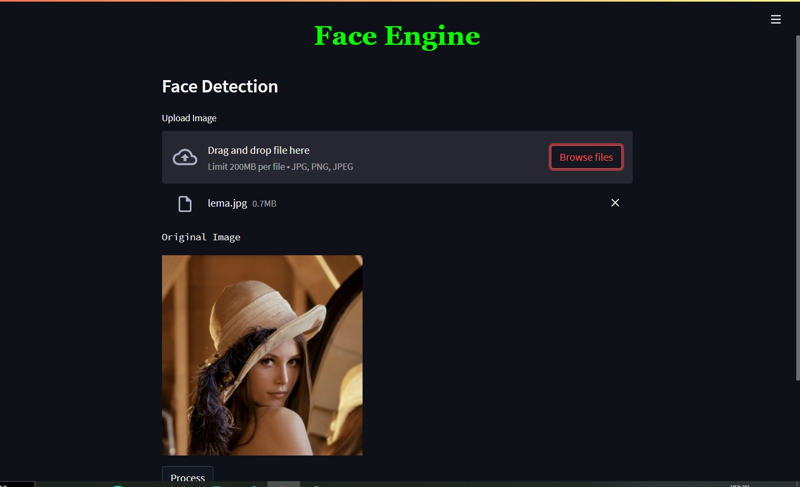

# 
 Face Engine 

__________________________

  

#### To Run this project :-

* Clone this repo into your local machine.
* Install all the required libraries.
* Type "streamlit run test.py" to run this project files. 
* Now visit to the URL, which is present in terminal.
* Now Play with images !

__________________________

## About Project

### It a multipurpose Face Engine using which we can perform different things on  an Image like :-

- Color to gray scale Image
- Increase or decrease contrast
- Brightness control
- Blurring Image
- Sharpening
- Pencil Sketch

______________________________

### Also Using this we can perform following this :-

- Faces Detection
- Smile Detection
- Eyes Detection
- Creating edges (Cannize)
- Cartonize

_____________________________

* This app is made using Python and Streamlit.
* Used Haarcascade for detection of eye, smile, face etc.
* OpenCV is also used for performing canny edge detection and cartonize.

